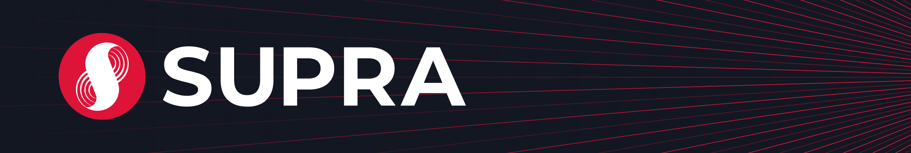

---

[Supra](https://supra.com) is a layer one blockchain with a focus on vertical integration and low latency. This repo serves as a monorepo for the Supra developer documentation.

## Getting Started

* [Supra](https://supra.com)
* [Supra Developer Docs](https://docs.supra.com/move/getting-started)
* Follow us on [Twitter](https://twitter.com/SUPRA_Labs).
* Join us on the [Supra Discord](https://discord.gg/supralabs).