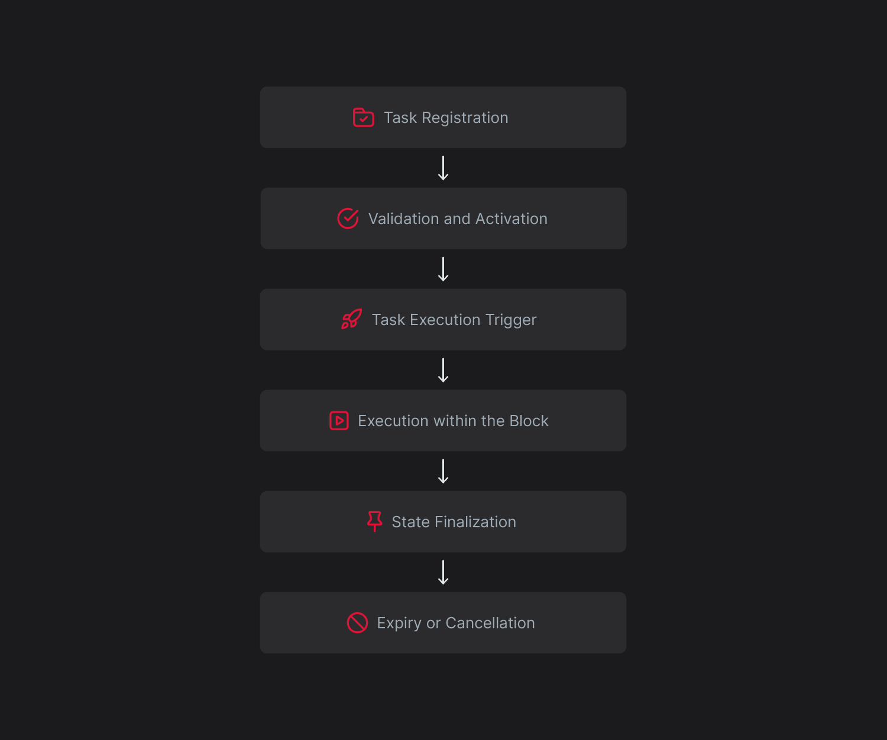

# Overview

### What is Supra Automation?

Supra Automation is a native execution engine that transforms how smart contracts operate. Traditional smart contracts are passive, they require external input to run. Developers and users must manually trigger transactions or rely on third-party bots to monitor conditions and act on their behalf.

Supra changes this model. It allows smart contracts to automatically respond to predefined conditions such as time, price feeds, or account balances. These automated tasks are submitted once and executed directly by the blockchain validators. No centralized system or external actor is involved.\
This brings proactive behavior into the blockchain environment. Contracts do not just sit idle waiting for input. They act based on logic and live data, enabling a new class of self-operating applications.

### Why is it important?

The Automation Network removes friction from on-chain systems. Developers no longer need to build or maintain scripts, bots, or third-party systems for scheduled or conditional tasks. Automation becomes an embedded capability.\
This shift benefits both users and builders:

* Tasks are executed precisely when conditions are met.
* Transactions run within the chain without depending on external relayers.
* Applications become responsive and intelligent without added complexity.
* The entire system becomes more predictable and programmable.\
  Supra is building toward a cross-chain future. Although current native automation operates solely within Supra's Layer 1, the upcoming SupraNova protocol is expected to enable automation tasks that can trigger and execute accross different blockchains. This will eventually suppport proper automated flows between ecosystems.

### How the Automation Network Works

Supra’s Automation Network works directly within the validator logic. Automation tasks are managed and executed as part of the block-building process. This architecture eliminates the delay between condition checking and execution, which is a common issue in off-chain or keeper-based automation systems.

#### Lifecycle of an Automation Task

This diagram will give you a brief idea of the Automation processes.

<figure><figcaption></figcaption></figure>

Automation on Supra follows a well-defined flow:

#### Step 1: Task Registration

A user or developer submits a task to the Automation Registry. The task includes a target function, arguments, and metadata such as gas limits, expiry time, and fee caps. Whether or not the task proceeds is determined by the internal logic of the target function. The function may or may not contain any conditional checks.

#### Step 2: Validation and Activation

During submission, the task is validated. This includes verifying function references, argument types, user balance, and registration fee limits. Once accepted, the task becomes eligible for activation at the beginning of the next epoch.

#### Step 3: Task Execution Trigger

Validators process the task's payload at the end of each block. They do not extract or evaluate any separate condition. Instead, they execute the target functions directly. These functions may contain conditional logic, which is based on the current state of the blockchain. This determines whether or not the action should be performed.

#### Step 4: Execution Within the Block

If a task’s condition evaluates to true, the action is immediately executed inside the current block. The task is treated like an internal transaction and becomes part of the final state update.

#### Step 5: State Finalization

After all regular and automated transactions are processed, the block output is finalized. The effects of the automation task are included in the finalized block result, and any events or fees are recorded.

#### Step 6: Expiry or Cancellation

Tasks remain active across blocks until they reach their expiry time or are cancelled. Cancellation can occur manually by the user, or automatically if task fee caps are exceeded or the account balance is insufficient to support execution. All cancellations, both manual and automatic are processed at the start of the next epoch.

### Important Features of Execution

* Automation runs directly inside the validator loop.
* Conditions are evaluated against actual blockchain state.
* No off-chain polling or relaying is involved.
* Tasks support custom logic via smart contract function calls.
* Execution does not increase sequence numbers or require separate user signatures.
* Fees are charged transparently at the time of registration, at each epoch for task retention, and gas fees are charged separately for every task execution at the end of a block.
* Supra’s system supports time-based triggers, real-time data from oracles, smart contract states, and custom user-defined logic all directly processed by the blockchain without relying on external infrastructure.
