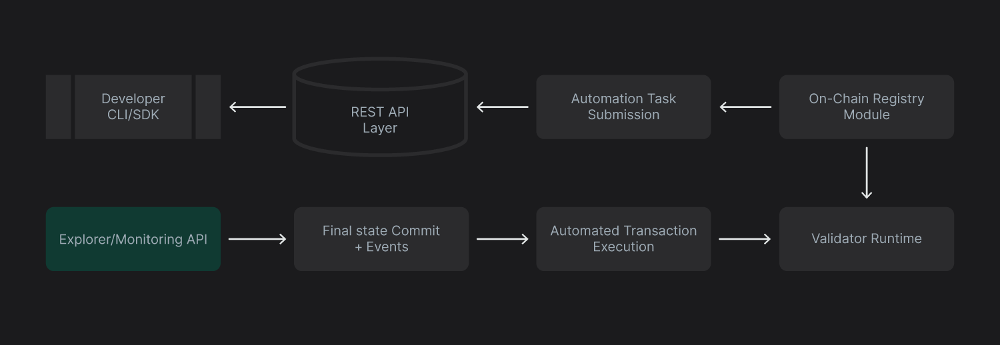
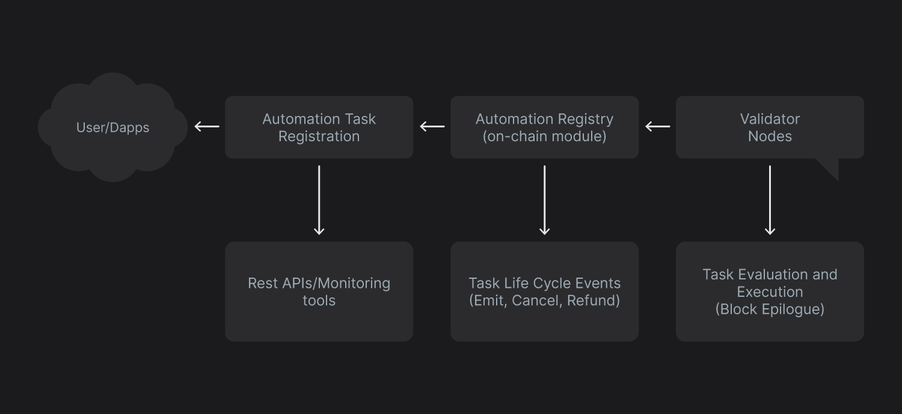

# API Reference

Supra provides a rich set of APIs for interacting with automation services, monitoring execution, and retrieving registry data. Below are the key components:

### Automation Registry Move Module

The on-chain module `automation_registry` provides the following APIs:

#### Registration

Users cannot call the `register()` function directly.Instead, tasks are registered by submitting a signed transaction that wraps the target function and its arguments into an internal payload. This is handled automatically via the Supra CLI, REST API, or SDK. The registry validates and activates the task based on submitted parameters and network rules.

**Example: Registering a Task Using Supra CLI**

```
bash
supra move automation register \
--task-max-gas-amount 50000 \
--task-gas-price-cap 200 \
--task-expiry-time-secs <TIMESTAMP> \
--task-automation-fee-cap 10000 \
--function-id "0x1::your_module::"function name" \
--args address:<recipient> u64:<amount>
```

This command prepares a task that invokes the specified fuction with the given arguments. It does not call `register()` directy, it creates a `signed` transaction that interacts with the on-chain registry.

To simulate task creation without submission, use the following command:

```
supra move automation register --simulate ...
```

#### Cancellation

```
public entry fun cancel_task(owner: &signer, id: u64)
```

This method cancels the task by index. The task remains scheduled for the current epoch and is removed in the next.

#### Read Functions

| Function name                                                           | Functionality                                                           |
| ----------------------------------------------------------------------- | ----------------------------------------------------------------------- |
| `public fun get_active_task_ids(): vector<u64>`                         | Returns all active tasks IDs for the current epoch.                     |
| `public fun get_task_details(id: u64): TaskMetadata`                    | Returns the full task metadata for a specific task ID.                  |
| `public fun get_task_count(): u64`                                      | Returns the total number of registered tasks.                           |
| `public fun get_automation_registry_config(): RegistryConfig`           | Returns the current automation registry configuration.                  |
| `public fun get_epoch_locked_balance(account: address): u64`            | Returns the locked balance for the given account (after current epoch). |
| `public fun has_sender_active_task_with_id(sendr:address, id:u64):bool` | Verifies whether the sender has an active task with given ID.           |

These functions allow visibility into registry state and configuration.

### REST API Endpoints

Supra exposes these REST endpoints for tracking automation activity:

| Enpoint                                            | Activity                                                                                    |
| -------------------------------------------------- | ------------------------------------------------------------------------------------------- |
| `/rpc/v3/block/{height}?type=auto`                 | Returns all successfully executed automation tasks in a given block.                        |
| `/rpc/v3/account/{address}/automated_transactions` | Lists all automated transactions tied to a given account.                                   |
| `/rpc/v3/transactions/{hash}`                      | Looks up a specific transaction by its hash and can be filtered by type (auto, user, meta). |

### Error Codes and Fee Events

#### Error Code

The registry exposes meaningful error codes for task validation issues, including:

| Error Code                   | Meaning                                                                    |
| ---------------------------- | -------------------------------------------------------------------------- |
| `EINVALID_EXPIRY`            | Task expiry timestamp is in the past or too soon.                          |
| `EINSUFFICIENT_BALANCE`      | Account does not hold enough balance for task registration.                |
| `EREGISTRY_FULL`             | Registry has reached its task capacity for the current epoch.              |
| `ECONGESTION_LIMIT_EXCEEDED` | Task's congestion fee cap is lower than required for current network load. |

These are surfaced via on-chain transaction logs and are useful for debugging or monitoring failed submissions.

#### Fee and Registry events

These events are emitted by the registry module and are indexed for external observability:

| Events                   | Description                                                     |
| ------------------------ | --------------------------------------------------------------- |
| `AutomationTaskMetadata` | Emitted when a task is accepted into the registry.              |
| `TaskCancelled`          | Triggered when a rask is manually cancelled or pruned.          |
| `AutomationFeeWithdrawn` | Indicates automation fees collected by the system.              |
| `AutomationRefundIssued` | Sent bwhen an unused task is refunded due to expiry or failure. |

The diagram below showx the API architecture map

<figure><figcaption></figcaption></figure>

### Registry API Overview

The Automation Registry is a native on-chain module that stores all registered tasks. This registry controls task lifecycle, condition validation, execution ordering, and expiry/cancellation management.\
Automation tasks are treated as internal transactions. These are executed directly by the blockchain’s validator layer.\


This diagram will give you an overview of interaction of Registry System

<figure><figcaption></figcaption></figure>

#### Core Registry Functions (Move Module)

**register(...)**

Registers a new automation task with all required metadata.

| Metadata                       | Function                                                           |
| ------------------------------ | ------------------------------------------------------------------ |
| `owner`                        | Signer address registering the task                                |
| `payload_tx`                   | Binary-encoded entry function call (contains condition and action) |
| `expiry_time`                  | Epoch timestamp when the task becomes invalid                      |
| `max_gas_amount`               | Maximum gas allowed per execution                                  |
| `gas_price_cap`                | Maximum acceptable gas price                                       |
| `automation_fee_cap_for_epoch` | Maximum automation fee for a single epoch                          |

Additional fiels used in registry:

* `tx_hash`: Hash of the registration transaction
* `aux_data`: Reserved for future use

**Cancel Task**

`cancel_task(owner, task_id)`: Cancels an existing task. Cancellation becomes effective from the next epoch.

**Read Functions (Views)**

| Method name                                                             | Function                                                                     |
| ----------------------------------------------------------------------- | ---------------------------------------------------------------------------- |
| `public fun get_task_ids(): vector<u64>`                                | List all registered task IDs                                                 |
| `public fun get_active_task_ids(): vector<u64>`                         | List active task IDs for the current epoch                                   |
| `public fun get_task_details(id:u64): TaskMetadata`                     | Returns metadata for a given task index                                      |
| `public fun get_task_count(): u64`                                      | Total number of registered tasks                                             |
| `public fun get_next_task_index(): u64`                                 | Predicts index for next registered task                                      |
| `public fun has_sender_active_task_with_id(address: addresss, id: u64)` | Verifies sender ownership                                                    |
| `public fun get_gas_committed_for_current_epoch(): u64`                 | Returns the amount of gas fee set for current epoch.                         |
| `public fun get_epoch_locked_balance(): u64`                            | Returns the locked balance after the epoch.                                  |
| `public fun get_registry_fee_address(): address`                        | Returns address of the fee.                                                  |
| `public fun estimate_automation_fee(task_occupancy: u64): u64`          | Returns the fee required for task occupancy.                                 |
| `public fun estimate_congestion_fee(task_occupancy: u64): u64`          | Returns the congestion fee added when registry is above occupancy threshold. |

### Task Metadata Structure

Each task includes:

* Task index and owner address
* Encoded function signature and arguments
* Expiry timestamp
* Gas limits and caps
* Current state: Pending, Active, Cancelled

### Fee Structure

#### Flat Registration Fee

Paid once during registration. Non-refundable.

#### Automation Fee (Per Epoch)

Charged at each epoch based on:

* Task’s max gas
* Registry’s congestion level
* Duration of task activity in the epoch.

#### Congestion Fee

It is applied when task occupancy exceeds a predefined threshold. It grows polynomially with congestion in the registry.

#### Refunds

Issued if the actual epoch duration is shorter than estimated, proportional to the unused time.

### Error Codes

The registry exposes descriptive error codes for:

* Invalid or expired time
* Invalid gas price or limits
* Unauthorized access
* Registry full or misconfigured
* Fee cap breaches

### Events

Emitted on:

* Task registration
* Task execution
* Fee withdrawals
* Refunds
* Cancellations
* Registry configuration changes
