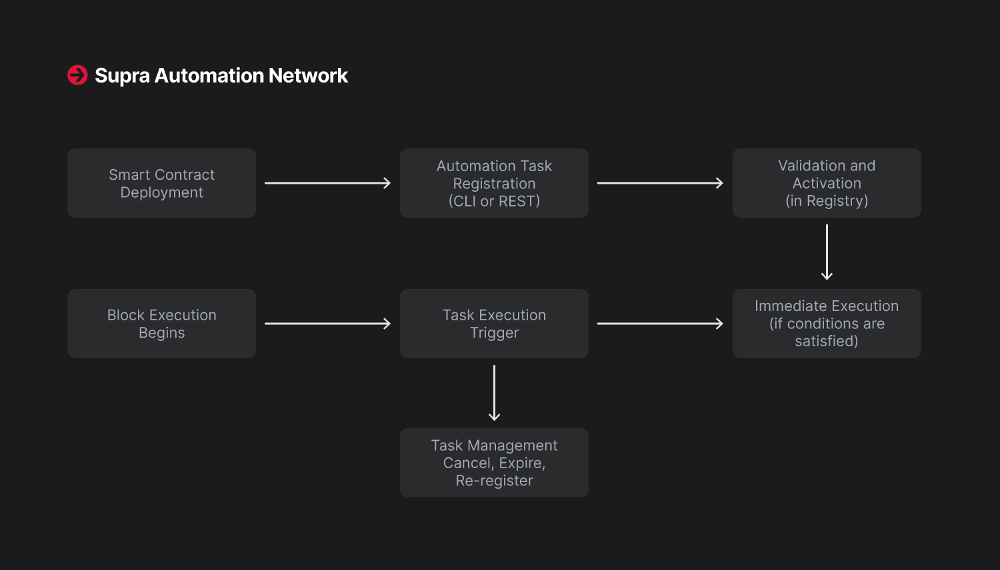

# Getting Started

## Getting Started for Developers

Supra’s Automation Network is built to be developer-friendly. It provides multiple interfaces for registering tasks, managing them, and observing execution. Developers can integrate automation into their applications with minimal setup using the REST API, Supra CLI, or the SDK.\
\
Here is an overview of a diagram which will give you the idea of the workflow.

<figure><figcaption></figcaption></figure>

***

## Basic Setup Requirements

**Before creating tasks, make sure the following conditions are met:**

* The target smart contract is **deployed** on the Supra network.&#x20;
* The target smart contract exposes **callable entry functions** to invoke automation.
* The developer wallet has **enough funds** to cover registration fees and automation gas costs.
* **Automation is enabled** on the network: usually active by default on supported Testnets and Mainnets.

***

## Registering an Automation Task

There are two ways to register an automation task:

### Using the Supra CLI

The CLI provides a straightforward interface:

```powershell
supra move automation register \
  --task-max-gas-amount 50000 \
  --task-gas-price-cap 200 \
  --task-expiry-time-secs <TIMESTAMP> \
  --task-automation-fee-cap 10000 \
  --function-id "0x1::your_module::function_name" \
  --args address:<recipient> U64:<amount>
```

This command registers a task that will call the specified function with the given arguments when its condition evaluates to true.

#### You can also simulate task creation using:

```
supra move automation register --simulate ...
```

### Using a REST API

You can also register tasks by submitting signed transactions via REST. The payload structure includes:

* Target entry function (The entry function includes the conditional logic that determines when to execute the task)
* Arguments
* Expiry time
* Maximum gas amount
* Gas price cap
* Automation fee cap

```json
// Sample Payload
{
  "target_entry_function": "0x1::your_module::function_name",
  "args": {
    "recipient": "address_here",
    "amount": "u64_value"
  },
  "expiry_time": "<TIMESTAMP>",
  "max_gas_amount": 50000,
  "gas_price_cap": 200,
  "automation_fee_cap": 10000
}

```


The REST interface accepts `AutomationRegistration` as a transaction payload type.


***

## Monitoring and Managing Tasks

#### Once registered, tasks are visible in the registry. You can:

* Query active task IDs using view functions.
* Fetch task metadata by index.
* Cancel a task with the `cancel_task API` or CLI sub-command.
* Estimate automation fees using REST view endpoints


**Tasks that expire or exceed fee limits are automatically removed at the start of the next epoch.**&#x20;

**Manually cancelled tasks also remain active until the current epoch ends and are removed in the following**

