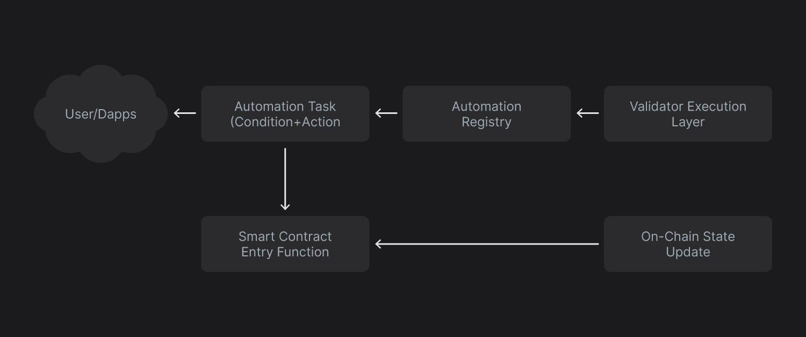

# Smart Contract Integration

Supra’s Automation Network is designed to work with any Move-based smart contract that exposes callable entry functions. To make a contract automation-compatible, developers need to ensure that target functions are publicly accessible and well-structured to be invoked automatically under specified conditions.


To understand the overview of the function flow, refer to the diagram below.

<figure><figcaption></figcaption></figure>

### Key Requirements

#### Entry Function Availability

The target contract must expose a public entry function with a fixed function name and argument types. This will maintain consistent reference during task registration.

#### Argument Compatibility

Arguments passed to the function during registration must exactly match the expected types. The validation engine checks signatures and types during registration.\
The target function may include at most one `signer` argument, which will always be the same signer that registered the automation task. **Note: Additional `signer` arguments are not supported and may result in validation failures or execution errors.**

#### Automation Logic Constraints

Since automated tasks are executed within validator logic, their behavior must remain fully deterministic and produce the same results across all the nodes to maintain consensus.

#### Gas Limits and Fee Caps

Each automation task must define the following parameters:

* `max_gas_amount`: Specifies the maximum gas the task is allowed to consume during execution.
* `gas_price_cap`: Sets the maximum acceptable gas price per block. If the network gas price exceeds this value during a block, the task is skipped for that block.
* `automation_fee_cap`: Defines the maximum automation fee a user is willing to pay per epoch. Tasks that exceed this cap are excluded from execution for that epoch.

These parameters collectively help manage cost ceilings, avoid unwanted execution during high gas conditions, and provide predictable automation expense control.

#### State Conditions Inside Logic

Automation tasks do not include external scripts. Instead, the condition should be wrapped into the logic of the target function. Example:

```move
if (balance > 10000) {
    transfer(user, recipient, balance - 10000);
}
```

**Example: Auto Wallet Top-Up**

**Use case: Automatically refill a user's wallet when the balance drops below a certain threshold.**

```move
public entry fun auto_top_up(source: &signer, user: address, min_balance: u64, top_up_amount: u64) {
    let current_balance = balance_of(user);
    if (current_balance < min_balance) {
        transfer(source, user, top_up_amount);
    }
}
```

_A task can be registered with a condition like:_\
_“If the balance of 0xABC is less than 50 SUPRA, transfer 100 SUPRA from 0xXYZ.”_

**Example: Target Limit Order Execution**

**Use case: Execute a swap or trade when a price condition is met.**

```move
public entry fun execute_limit_order(user: &signer, token_a: address, token_b: address, price_threshold: u64) {
    let price = get_price(token_a);
    if (price <= price_threshold) {
        swap(user, token_a, token_b);
    }
}
```

_Oracle data is read on-chain using Supra’s oracle feeds. Once the condition is satisfied, the task is executed in the same block._

### Best Practices

* Use clear conditions with safe fallback logic.
* Make sure actions are idempotent when needed.
* Always add gas caps and expiry times.
* Test logic using simulation tools before registering.
