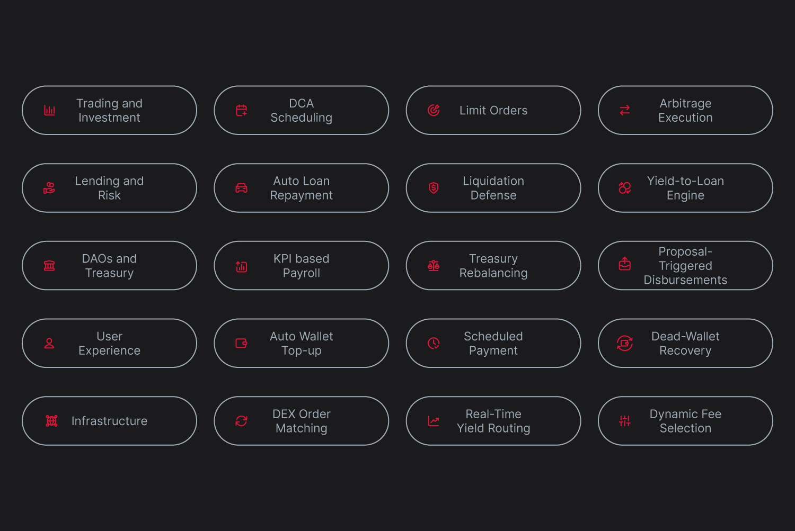

# Use Cases of AutoFi

AutoFi represents the real-world application layer of Supra’s Automation Network. With native automation built into the chain, developers can create financial systems that are responsive, intelligent, and user-friendly without sacrificing decentralization.\

Here are some high-impact use cases categorized by function.

### Trading and Investment

#### Time-Based Limit Orders

_“Buy ETH at $1,900 after 6 PM UTC.”_

The order executes only when both the price and time condition are met.

#### Dollar-Cost Averaging (DCA)

_“Buy 100 USDC worth of BTC every Monday.”_

A scheduled task executes the buy every week without external bots.

#### Cross-Chain Arbitrage Execution

_“If price spread between DEX A and DEX B is above 2%, perform arbitrage.”_

The task can compare prices and execute swaps across chains once SupraNova goes live.

### Risk Management and Loans

#### Auto Loan Repayment

_“Use yield to repay loans when LTV exceeds 70%.”_

Tasks monitor vault metrics and trigger repayments automatically.

#### Liquidation Defense

_“Repay stablecoins from reserve if vault health drops.”_

Protect users from unexpected liquidations in volatile markets.

### DAOs and Treasury Management

#### KPI-Triggered Payroll

_“Pay team if 100 GitHub commits are reached.”_

Oracles monitor off-chain metrics. Payment executes on-chain when the KPI is hit.

#### DAO Treasury Rebalancing

_“Maintain a 60-40 allocation between USDC and ETH.”_

Tasks run block-by-block rebalancing strategies with no human input.

### User Experience Automation

#### Auto Wallet Top-Up

_“If wallet drops below 10 SUPRA, refill from treasury.”_

Improves UX for games, dApps, and recurring users.

#### Scheduled Payments (Subscriptions)

_“Send 5 USDC to creator wallet monthly.”_

Subscriptions run without relying on Web2 intermediaries or custodial services.

### DeFi Infrastructure

#### On-Chain DEX Order Matching

_Orders from users are matched directly on-chain when conditions align._

No need for off-chain bots or liquidity managers. Tasks perform real-time matching.

#### Real-Time Yield Optimization

_“Move funds to the highest APY protocol every 12 hours.”_

Capital allocation becomes a living process managed on-chain.\

Below you can find the AutoFi use case map.

<figure><figcaption></figcaption></figure>
