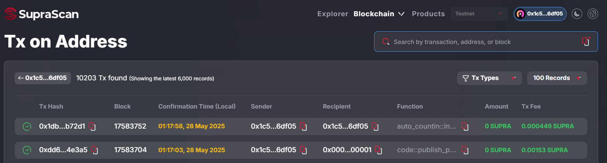

# Create the Move Smart Contract

For this guide we'll create an automation contract that will increment a default value with each automated transaction once the automaton task gets started. We can then use the view function and/or SupraScan to see the updated value, old value, timestamp, and total increments.

## Initialize your move package



#### Create a new Move package


```powershell
supra move tool init --package-dir /supra/move_workspace/autofi --name autofi
```


This will create your project directory automatically, including a `Move.toml` file. This is a manifest file that contains important metadata about your package. This includes the package name, version, dependencies, named addresses, and more.

The `SupraFramework` dependency is automatically populated. This framework includes core components that you will interact with during your time on Supra. The framework package includes clearly defined documentation within the `/doc` directory for you to review alongside the Move code within the `/sources` directory. You can view [this package here](https://github.com/Entropy-Foundation/aptos-core/tree/dev/aptos-move/framework/supra-framework).


```toml
[package]
name = "autofi"
version = "1.0.0"
authors = []

[addresses]

[dev-addresses]

[dependencies.SupraFramework]
git = "https://github.com/Entropy-Foundation/aptos-core.git"
rev = "dev"
subdir = "aptos-move/framework/supra-framework"

[dev-dependencies]

```




#### Update the named addresses

Open the `move.toml` file with your code editor. You can find these files on your host machine in the `/supra/move_workspace/autofi` directory.

For now, add the below named address to your `Move.toml` file and set the value to your address.


You can view the address of your profiles by executing: `supra profile -l`


```toml
[addresses]
exampleAddress ="YOUR-ADDRESS-HERE"
```

Named addresses allow identifiers such as `@exampleAddress` to be used throughout your package, rather than hard coding an address value. When compiled into bytecode, any occurrence of the identifier such as `@exampleAddress` will be replaced with the value set within the `move.toml` file.



## Write & Publish Your Module



#### Create a Module Smart Contract (Module)


Open the `move.toml` file with your code editor and set the value to your address to the Profile address of your Supra CLI to Publish the Move Package. Know more about Writing and Publishing your first Move Package at the [**Get Started Page Here.**](https://app.gitbook.com/s/mTBWRilfF5GuWWSNVrjY/getting-started/create-a-move-package)\


And, Within the `sources` directory of your package, create the `autofi.move` file.



```
module exampleAddress::auto_incr {
    use supra_framework::timestamp;
    use supra_framework::event;
    use supra_framework::account;
    use std::signer;
    use std::error;

    struct Counter has key {
        value: u64,
        last_increment_time: u64,
        total_increments: u64,
    }
    /// Event emitted when counter is incremented
    #[event]
    struct CounterIncremented has drop, store {
        old_value: u64,
        new_value: u64,
        timestamp: u64,
        total_increments: u64,
    }
    /// Error codes
    const E_COUNTER_NOT_INITIALIZED: u64 = 1;
    const E_TOO_EARLY_FOR_INCREMENT: u64 = 2;

    fun init_module(account: &signer) {
        let account_addr = signer::address_of(account);
    
        assert!(!exists<Counter>(account_addr), error::already_exists(E_COUNTER_NOT_INITIALIZED));
        let current_time = timestamp::now_seconds();
        
        move_to(account, Counter {
            value: 0,
            last_increment_time: current_time,
            total_increments: 0,
        });
    }
    public entry fun auto_increment(account: &signer) acquires Counter {
        let account_addr = signer::address_of(account);

        assert!(exists<Counter>(account_addr), error::not_found(E_COUNTER_NOT_INITIALIZED));
        
        let counter = borrow_global_mut<Counter>(account_addr);
        let current_time = timestamp::now_seconds();
        let old_value = counter.value;
        counter.value = counter.value + 1;
        counter.last_increment_time = current_time;
        counter.total_increments = counter.total_increments + 1;
        event::emit(CounterIncremented {
            old_value,
            new_value: counter.value,
            timestamp: current_time,
            total_increments: counter.total_increments,
        });
    }

    /// View function to get current counter value
    #[view]
    public fun get_counter_value(account_addr: address): u64 acquires Counter {
        assert!(exists<Counter>(account_addr), error::not_found(E_COUNTER_NOT_INITIALIZED));
        borrow_global<Counter>(account_addr).value
    }
    /// View function to get detailed counter info
    #[view]
    public fun get_counter_info(account_addr: address): (u64, u64, u64) acquires Counter {
        assert!(exists<Counter>(account_addr), error::not_found(E_COUNTER_NOT_INITIALIZED));
        let counter = borrow_global<Counter>(account_addr);
        (counter.value, counter.last_increment_time, counter.total_increments)
    }

    /// Manual increment function for testing (optional)
    public entry fun manual_increment(account: &signer) acquires Counter {
        auto_increment(account);
    }
    /// Reset counter (for testing purposes)
    public entry fun reset_counter(account: &signer) acquires Counter {
        let account_addr = signer::address_of(account);
        assert!(exists<Counter>(account_addr), error::not_found(E_COUNTER_NOT_INITIALIZED));
        
        let counter = borrow_global_mut<Counter>(account_addr);
        counter.value = 0;
        counter.last_increment_time = timestamp::now_seconds();
        counter.total_increments = 0;
    }

    // Test functions
    #[test_only]
    #[test(account = @0x123)]
    public entry fun test_counter_initialization(account: signer) acquires Counter {
        let account_addr = signer::address_of(&account);
        account::create_account_for_test(account_addr);
        // Initialize counter
        init_module(&account);        
        // Check initial value
        assert!(get_counter_value(account_addr) == 0, 1);
        // Test increment
        manual_increment(&account);
        assert!(get_counter_value(account_addr) == 1, 2);
        // Test another increment
        manual_increment(&account);
        assert!(get_counter_value(account_addr) == 2, 3);
    }
}
```




#### Publish Your Move Package on Supra Network.

```powershell
supra move tool publish \
--package-dir /supra/move_workspace/autofi \ 
--rpc-url https://rpc-testnet.supra.com
```



#### Use [SupraScan](https://suprascan.io/) to confirm it was deployed successfully.

<figure><figcaption></figcaption></figure>


