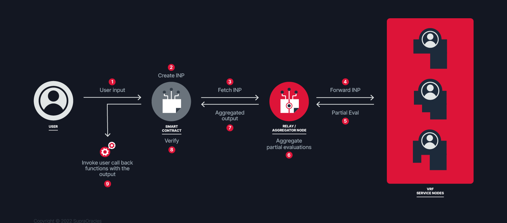

# Overview

On-chain and off-chain applications connected to gaming, lottery, and sampling rely heavily on entropy. It could be a dynamic NFT mint, loot boxes, random opponent pairing, randomized spawn environments, an in-game item upgrade, a lottery, or a selection of contributors for an IDO. Randomness in applications is supposed to ensure fair and equal possibilities for participants. Random Number Generation (RNG) has to be unbiased and tamper-proof to be deemed fair. In other words, the process can't be manipulated by any participant, and the randomness that was generated is immutably and publicly verifiable thereafter.

Blockchain-based verifiable random functions (VRFs) enable the generation of numbers that are as good as random (pseudorandom) and can be (publicly) verified on-chain. Pseudorandomness guarantees both unpredictability and fairness in RNG, whereas tamper-proofness is demonstrated by via transparency inherent to their immutable on-chain records and verifiability.

### Supra dVRF

Supra’s dVRF can provide the exact properties required for a random number generator (RNG) to be fair with tamper-proof, unbiased, and cryptographically verifiable random numbers to be employed by smart contracts.

**Unbiased and Unpredictable** - The threshold signature of the nonce, client-provided input, and blockhash of the transaction that requests the randomness (which is unknown at the time of request) is used as the seed for the RNG functio&#x6E;**.**

**Tamper Proof and Verifiable** - Cryptographic proof will be provided to verify that random numbers were generated and communicated with the highest fidelity.

**Supra VRF Architecture**

<figure><figcaption>
Supra decentralised VRF (dVRF) architecture overview
</figcaption></figure>

Available Networks

Please refer to the [_Available Networks_](./#available-networks) _page_ for the networks supported.

### Accessing Supra dVRF

Supra dVRF  operates on a customer-controlled wallet subscription model where your registered wallet address serves as the main reference for access permissions and callback transaction gas fee payments.

Please visit [https://supra.com/data/dvrf](https://supra.com/data/dvrf) to create your first subscription.&#x20;

Please refer to the [VRF Developer Guide](build-with-supra-dvrf/v2-guide.md) for a step-by-step explanation of how to consume Supra’s dVRF services.


Important: Please make sure you read and understand [Terms of Use](https://supra.com/terms-of-use/) before start using Supra products and services.

