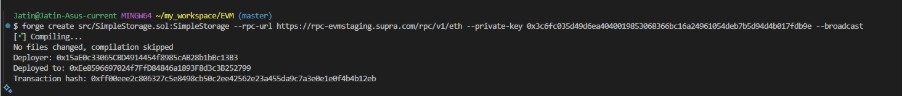

# Deploying Smart Contract

***

### Compile the Contract

Run `forge build` to compile your **Solidity smart contract**, ensuring that the code is free of errors and ready for deployment on **SupraEVM**.

```
forge build
```

### Deploy the Contract using force create:

Use `forge create` to deploy your contract on **SupraEVM**, specifying the contract path, RPC URL, and private key. This command will broadcast the transaction to the network, making the contract live.


```
forge create src/SimpleStorage.sol:SimpleStorage --rpc-url https://rpc-evmstaging.supra.com/rpc/v1/eth --private-key 0xPrivateKey --broadcast 
```


<figure><figcaption></figcaption></figure>

***

### Using Cast Send for Transactions

Interact with your deployed contract using `cast send`, which allows you to execute functions on-chain.

You can interact with the deployed contract using `cast send`.

For example, to call the `set` function:


```
cast send <DeployedContractAddress> "set(uint256)" 42 --rpc-url https://rpc-evmstaging.supra.com/rpc/v1/eth --private-key 0xYourPrivateKey
```


***

### View Contract State using Cast Call

Retrieve stored data from your contract using `cast call`, which reads contract state without sending a transaction, making it gas-free.

To view the state of the contract, use `cast call`:


```
cast call <DeployedContractAddress> "get() view returns (uint256)" --rpc-url https://rpc-evmstaging.supra.com/rpc/v1/eth
```


By using `forge create` and `cast send`, you can deploy and interact with your smart contract on the Supra EVM network.
