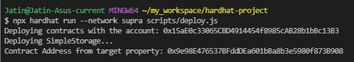

# Deploying Smart Contract

***

### Compile Smart Contract

Use **Hardhat** to compile your **Solidity smart contract**, ensuring it is error-free and ready for deployment on **SupraEVM**.

* Compile the contract using Hardhat:

```
npx hardhat compile
```

### Run Deployment Script

Execute the **Hardhat deployment script** to deploy your smart contract on **SupraEVM**, ensuring it is live and ready for interaction.

* Run the deployment script:

```
npx hardhat run --network supra scripts/deploy.js
```

<figure><figcaption></figcaption></figure>
