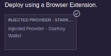

# Connect StarKey Wallet to Remix

***

### Using Remix IDE

* Open [Remix IDE](https://remix.ethereum.org/#lang=en\&optimize=false\&runs=200\&evmVersion=null\&version=soljson-v0.8.18+commit.87f61d96.js).
* Click on the Deploy and Run Transactions icon on the left sidebar.
* Click on Customize this List.
* Select Injected Provider - [Starkey Wallet](https://starkey.app/).

Ensure your Starkey Wallet is connected to the Supra EVM network.

<figure><figcaption></figcaption></figure>
