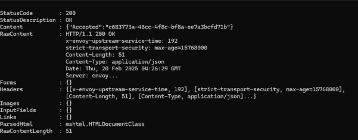

# Fund Your Wallet

***

### Using StarKey Wallet:

* Select EVM Stagingnet from the network dropdown.
* Select the EVM Staging token from the asset list.
* Press the "**Collect**" faucet button.
* Run the following command in your terminal, replacing `0xYourStarkeyAddress` with your actual wallet address:

```powershell
curl https://rpc-evmstaging.supra.com/rpc/v1/wallet/evm_faucet/0xYourStarkeyAddress
```

### Result:

<figure><figcaption></figcaption></figure>
