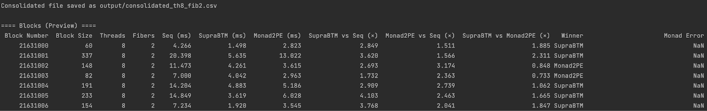

# SupraEVM Beta

SupraEVM Beta powered by **SupraBTM** (Supra's conflict specification-aware Block Transactional Memory) - a parallel transaction execution framework that achieves breakthrough performance in EVM transaction processing.

#### Performance Highlights

* **\~4× speedup** over traditional sequential execution
* **\~1.5-1.7× speedup** over 2-phase optimistic parallel execution
* **Executes in \~50% less time** compared to known state-of-the-art
* Evaluated on 10,000 historical Ethereum blocks

**Detailed Technical Analysis**: For a comprehensive comparison of both approaches, read our study: [Supra vs Monad: Towards the Best Parallel Execution of the Ethereum Virtual Machine](https://supra.com/academy/supra-vs-monad-towards-the-best-parallel-execution-of-the-ethereum-virtual-machine/)

***

### Quick Navigation

* [SupraBTM vs Sequential Execution](supraevm-beta.md#suprabtm-binary-installation-and-setup)
* [SupraBTM vs. Monad](supraevm-beta.md#monad-2pe-vs-suprabtm-benchmarking)
* [View Results & Analysis](supraevm-beta.md#final-analysis-suprabtm-vs-monad-2pe)

***

### What is SupraBTM?

**SupraBTM** is built on [**iBTM (Intelligent Block Transactional Memory)**](https://drops.dagstuhl.de/entities/document/10.4230/LIPIcs.AFT.2025.29), a parallel transaction execution framework inspired by BlockSTM and designed to bring scalable, concurrent execution to Ethereum-like environments.

It leverages Software Transactional Memory (STM) principles, conflict analysis, and adaptive scheduling to achieve high throughput while preserving safety and determinism. Supra's iBTM adapts STM principles to the EVM context, allowing parallel execution of Ethereum transactions. It integrates seamlessly into the RISE-PEVM framework, extending its architecture to support intelligent dependency resolution and adaptive conflict management.

***

### Release Information:&#x20;

#### v0.1 (In-Memory Beta) - Current Version

* Stable and fully functional integration of iBTM with [Hydrangea](https://x.com/SUPRA_Labs/status/1933726886393221246)
* In-memory EVM execution with SupraBTM
* Binary-only release
* Historical Ethereum block dataset
* Performance benchmarking tools:
  * Sequential vs SupraBTM
  * Monad Comparison: Final testing against Monad 2PE.

***

### Minimum System Requirements

* Linux (Ubuntu 20.04+, Debian 11+)
* Windows with WSL2
* gdown (for dataset download)
* **Docker**: Required for running the pre-compiled binary
* **Networking**: 2 × 10 Gbps NICs
* **CPU**: AMD 4564P, 16 cores @ 4.5 GHz with 128 GB
* **Storage**: 2 × 480 GB NVMe + 2 × 1.9 TB NVMe
* AMD Ryzen 9950x, AMD Ryzen 7950x, AMD EPYC 4584PX, etc.

***

### SupraBTM Binary Installation & Setup



**Create Working Directory**

```bash
# Create a directory for the benchmark
mkdir supraevmbeta
cd supraevmbeta
```



**Download the Dataset**

```bash
# Download the dataset 
gdown --id 1zgP48T3IAmg5yDkaN4h9RaD09klMN5QF

# Extract it
unzip ./data_bdf.zip
```


**You can go to the** `./data_bdf` **folder to check the Block Dataset.**\
This will take time depending on your hardware specs as well as internet connection.




**Create Output Directory**

```bash
mkdir stats
```



**Run the Benchmark by pulling the docker image!!**

```bash
sudo docker run --rm \
  --cpuset-cpus="0-7" \
  -v "$PWD/data_bdf:/data" \
  -v "$PWD/stats:/out" \
  rohitkapoor9312/ibtm-image:latest \
  --data-dir /data \
  --output-dir /out \
  --inmemory
```


\--cpuset-cpus="0-7" creates affinity for cpu cores, and can be adjusted according to experiment.




#### Output

Each record contains execution logs for both **sequential** and **iBTM** runs, including:

* Block number
* Block size (number of transactions)
* Sequential execution time
* iBTM execution time

**What you'll see:** The benchmark will process each block and show progress:

```
================================================================
Block Number: "14000011"
================================================================
Block Number: "14000018"
================================================================
Block Number: "14000022"
...
```

#### View Your Results

```bash
cat ./stats/execution_time.txt
```

**Sample output:**

```
Block_num	Concurrency_level	Block_size	Seq. Time	iBTM Time
14000011	12	                99	        3.850743ms      1.724187ms
14000018	12	                115	        2.135975ms	748.909µs
14000022	12	                339	        7.706865ms	2.026971ms
```

### Monad 2PE vs SupraBTM Benchmarking


This section continues forward after setting up SupraBTM Binary following above setup




**Setting up the Benchmark Environment**

```bash
# Create a directory to store all benchmark-related files & Navigate in it.
mkdir monad-bench
cd ./monad-bench
```



**Download the shell script**

Before proceeding, ensure that your SSH key is properly configured and added to your Git account to enable secure cloning of the repository. If not, follow this link to setup: [Generating a new SSH key and adding it to the ssh-agent - GitHub Docs](https://docs.github.com/en/authentication/connecting-to-github-with-ssh/generating-a-new-ssh-key-and-adding-it-to-the-ssh-agent)

```bash
# Download the shell script 
gdown 1JF9K7_nXMsptlTNHB9Jf7mV4SUwCsza-
```



**Make the script executable and run it.**


Please note that the process may take some time as it clones the Monad execution repository and sets up the full benchmarking environment.


```bash
chmod +x monad_full_setup.sh
./monad_full_setup.sh monad
```

The script `monad_full_setup.sh` automates the setup required to benchmark historical Ethereum blocks using the Monad framework.&#x20;

1. **Repository Setup**: It begins by cloning the Monad repository and checking out the specific commit 8ffc2b985c34c7cf361a5ea1712321f8f8ec7b6b to ensure reproducible builds and updates the submodules.
2. **Benchmark Data Preparation**: Downloads the required historical block datasets containing 500 random blocks from 10,000 historical ethereum blocks.\
   Each dataset consists of:

* Parses the RLP-encoded block and decodes its transactions and header.
* The blockchain state snapshot initialization before executing the given block.
* Loads the pre-state from JSON and commits to the database to initialize the execution environment.
* Creates a BlockState and EVM instance

3. **Code Updates**: The benchmark is implemented in historical\_test.cpp.\
   For each block file, the test:\

   1. Logs key performance metrics, including block number, thread count, fiber count, block size, and average execution time, to `monad_2pe_logs.txt`.
   2. Execution parameters such as the number of threads and fibers are configurable via the environment variables `POOL_THREADS` and `POOL_FIBERS`.
   3. Comment out line [47](https://github.com/category-labs/monad/blob/8ffc2b985c34c7cf361a5ea1712321f8f8ec7b6b/category/execution/ethereum/block_hash_buffer.cpp#L47) from `block_hash_buffer.cpp`, to support executing random blocks by providing the pre-state which would not meet the bounds imposed for executing a block.
   4. Comment out the line[ 463](https://github.com/category-labs/monad/blob/8ffc2b985c34c7cf361a5ea1712321f8f8ec7b6b/category/execution/ethereum/execute_transaction.cpp#L463) from `exeute_transaction.cpp`, to resolve the state issues while during execution with multiple fibers.
   5. Moved line [281](https://github.com/category-labs/monad/blob/8ffc2b985c34c7cf361a5ea1712321f8f8ec7b6b/category/execution/ethereum/execute_block.cpp#L281) from `execute_block.cpp`, after the while loop since block transaction execution when all the worker threads complete their execution tasks.
   6. Turn off the compiler testing flag at lines [75](https://github.com/category-labs/monad/blob/8ffc2b985c34c7cf361a5ea1712321f8f8ec7b6b/docker/Dockerfile#L75) and [91 ](https://github.com/category-labs/monad/blob/8ffc2b985c34c7cf361a5ea1712321f8f8ec7b6b/docker/Dockerfile#L91)and comment lines [87](https://github.com/category-labs/monad/blob/8ffc2b985c34c7cf361a5ea1712321f8f8ec7b6b/docker/Dockerfile#L87) to[ 96 ](https://github.com/category-labs/monad/blob/8ffc2b985c34c7cf361a5ea1712321f8f8ec7b6b/docker/Dockerfile#L96)from the `Dockerfile`, in order to execute the historical benchmarks with minimal steps.


The Monad 2PE setup instructions are from us based on our experience of running the available codebase [https://github.com/category-labs/monad](https://github.com/category-labs/monad) (commit hash: `8ffc2b985c34c7cf361a5ea1712321f8f8ec7b6b`). We want to leave it to other devs or Monad devs to choose to run experiments their own way as long as it satisfies their needs for testing Monad execution. Our scripts are more to make life easy to run historical tests.




**Builds the docker image for the benchmark.**

```bash
cd ./monad
sudo docker build -t monad-dev-image -f docker/Dockerfile .
```



**Run the docker image and it'll you inside Docker then go to the workspace by:**

```bash
sudo docker run -it --rm \
--privileged \
-v $(pwd):/workspace \
monad-dev-image

cd ./workspace

CC=gcc-15 CXX=g++-15 CFLAGS="-march=haswell" CXXFLAGS="-march=haswell" ASMFLAGS="-march=haswell" \
./scripts/configure.sh && ./scripts/build.sh

POOL_THREADS=8 POOL_FIBERS=2 taskset -c 0-7 ./build/test/ethereum_test/monad-ethereum-test --fork Prague
```


You can change the number of threads by setting `POOL_THREADS` and `POOL_FIBERS` to compare performance at different configurations of 2PE.

Copies all benchmark results and log files from the container to the host machine under the `monad/monad_2pe_logs.txt` directory for analysis and record-keeping.




#### Final Analysis SupraBTM vs Monad 2PE.

**Get logs for both iBTM and 2PE in one repository:**

```
./stats/
├── monad_2pe_logs.txt
└── execution_time.txt
```

**Download and move the python script into `./stats` and run**

```bash
# Download the python script in ./stats/
gdown 1shdmZWrZHgz0bxyjkn9efzL-soHuWRn7
# Run
python3 analysis.py execution_time.txt monad_2pe_logs.txt
```

**The script outputs both console and file summaries.** Results are stored in:&#x20;

* Consolidated file saved in `output/consolidated_th8_fib2.csv` → per-block metrics
* &#x20;`summary/summary_th8_fib2.txt` → aggregated statistics

#### Sample output

<figure><figcaption></figcaption></figure>

<figure><figcaption></figcaption></figure>

***

#### What's Next?


**25,000 USDC is on the line for the first dev who proves us wrong.** [**Check Bounty Page Here.**](supraevm-beta-bounty.md)


***

### Core Design Principles

**Conflict-Aware Parallelism**: Transactions with known access specifications undergo static conflict analysis to detect dependencies early.

**Optimistic Execution**: Transactions lacking access metadata are executed optimistically using lightweight STM.

**Adaptive Execution**: The scheduler dynamically switches between sequential, optimistic, and conflict-aware modes based on block characteristics.

**Conflict Analyzer**: The current version uses a simplified analyzer. Upcoming versions will include:

* Full conflict graph extraction
* Fine-grained dependency tracking
* Dynamic adaptive schedulers (Sequential, iBTM, dBTM and oBTM)

**Read more in detail about our Research:** [https://drops.dagstuhl.de/entities/document/10.4230/LIPIcs.AFT.2025.29](https://drops.dagstuhl.de/entities/document/10.4230/LIPIcs.AFT.2025.29)

***

### System Architecture

```
┌───────────────────────────────────────────────────┐
│ Block Input                                       │
│ (Transactions, Metadata)                          │
└─────────────────────────┬─────────────────────────┘
                          │
                          ▼
┌───────────────────────────────────────────────────┐
│ Access Specification Parser                       │
│ → Detects known read/write sets                   │
│ → Annotates transactions with dependency hints    │
└─────────────────────────┬─────────────────────────┘
                          │
                          ▼
┌───────────────────────────────────────────────────┐
│ Conflict Analyzer (iBTM)                          │
│ → Builds dependency graph                         │
│ → Tags dependent transactions for ordered execution│
└─────────────────────────┬─────────────────────────┘
                          │
                          ▼
┌───────────────────────────────────────────────────┐
│ Executor (Parallel STM Engine)                    │
│ → Executes independent transactions concurrently  │
│ → Aborts & replays on conflict detection          │
│ → Commits with deterministic ordering             │
└───────────────────────────────────────────────────┘
```

***
