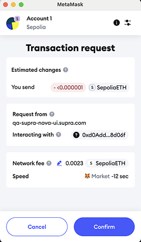

# Bridging Flow

This section explains how to use the SupraNova Bridge dApp to bridging ETH from Ethereum to supETH on Supra network, with each technical stage explained clearly.



### Connecting Your Wallets

Before initiating a bridge transaction, you must connect two wallets:

| Wallet                                   | Purpose                                               |
| ---------------------------------------- | ----------------------------------------------------- |
| MetaMask (Ethereum) or any source wallet | To send the ETH and sign the bridge transaction       |
| Supra Wallet                             | To receive Supra wrapped ETH (supETH) minted on Supra |

#### Getting Started:

* Open the SupraNova Bridge dApp.
* Click “Connect Wallet” on the top right corner.
* Approve the MetaMask pop-up to connect your Ethereum wallet.
* Choose your Supra Wallet (StarKey Wallet) or manually enter a recipient address using the “Type Recipient Address” toggle.

<figure><figcaption></figcaption></figure>

The toggle is notated as 1 and the existing wallet is notated as 2.


* **The Supra Wallet is where your minted supETH will arrive after successful bridging.**
* **Make sure the address is correct before proceeding.**





### Initiating the Bridge Transaction

After wallets are connected, follow these steps.

Under the Bridge tab, **select**:

* Source Chain: Ethereum
* Destination Chain: Supra
* Token: ETH –>  supETH
* Enter the amount of ETH you wish to bridge.

**Review**:

1. Estimated bridge time
2. Bridge fee breakdown (in ETH and $SUPRA)

Click **“Confirm”** to proceed.

<figure><figcaption></figcaption></figure>


**This action calls the HyperNovaCore smart contract on Ethereum, locking your ETH and emitting a LOGX event signaling a bridge request.**




### MetaMask Transaction Confirmation

Upon clicking **“Confirm”**:

* MetaMask prompts you to confirm the transaction.
* Gas fees are shown (normal Ethereum fees apply).
* Approve and confirm the transaction

<figure><figcaption></figcaption></figure>



### Event Capture and Proof Generation by Relayer

After the bridge event is emitted, The Event Listener captures the bridge event from the ethereum chain and stores it in a message queue. The Relayer Driver then consumes the event. detects the bridge event from the Ethereum chain.

It generates the following proofs:\

* **Sync Committee Proof** – Block signed by the Sync Committee
* **Receipt Proof** – Proof that the transaction succeeded
* **Ancestry Proof** (if the block lacks enough signatures)


If required, Ancestry Proof connects the event’s block to a more recent, heavily signed block.


#### The Technical flow is as follows:

**Ethereum Event → Relayer captures → Builds Proof Bundle → Prepares Submission to Supra**



### Proof Submission and On-Chain Verification

Once proofs are generated:

* The Relayer submits the proof bundle to Supra’s HyperNovaCore verifier smart contract.
* The verifier checks:
* Validity of the block header signatures
* Correctness of transaction existence and execution
* Authenticity of the event data (right source, token, amount, recipient)\
  If all checks pass, the verifier marks the bridge request as valid.



### Token Minting and Fund Receipt

Upon successful verification:

* The Token Bridge Service Contract is triggered.
* Supra Wrapped ETH (supETH) is minted on Supra in a 1:1 ratio to the locked ETH.
* The minted supETH is sent to your connected (or specified) Supra Wallet address.

You can now:

* View transaction history under Explorer > My Transactions.

<figure><figcaption></figcaption></figure>



### &#x20;Transaction Lifecycle Summary

| Stage              | System Action                             | User Action           |
| ------------------ | ----------------------------------------- | --------------------- |
| Wallet Connection  | Connect MetaMask and Supra Wallet         | Click Connect Wallet  |
| Initiate Bridge    | Lock ETH on Ethereum                      | Enter Amount, Confirm |
| Event Emission     | Emit bridge request log                   | Wait                  |
| Relayer Proofs     | Generate, Sync , Receipt, Ancestry proofs | Wait                  |
| Supra Verification | Validate proofs on-chain                  | Monitor Explore       |
| Token Min          | Mint supETH to recipient wallet           | Receive tokens        |


**During Bridging these are the in-built safeguards:**

* **Incomplete Proofs: Bridge request remains pending until sufficient proofs arrive.**
* **Relayer Failure: Another permissionless relayer can submit the proof.**
* **Committee Key Rotation: If Sync Committee public keys expire, Committee Updater submits fresh keys to Supra automatically.**

