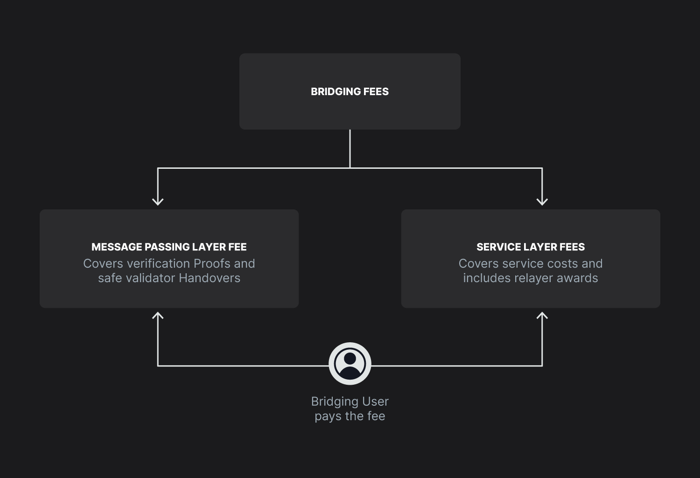

# Fee Structure in SupraNova

SupraNova’s fee model is designed to sustain a permissionless, decentralized bridging ecosystem while incentivizing critical actors like relayers and committee updaters.

<figure><figcaption></figcaption></figure>

SupraNova applies two levels of fees internally but simplifies the user experience by exposing only the Service Layer Fee during transaction confirmation.\

* **Verification Fee:**\
  This internal fee compensates only the committee updaters for proof generation, signature validation, and validators’ public key update operations. It is the responsibility of the Service Layer to pay this fee to the message passing layer Users do not see this fee directly.\

* **Service Layer Fee:**\
  This fee is displayed to users during bridging and deducted at the time of submitting the request. It covers protocol operational costs, treasury buildup, relayer incentives and other service specific expenses.\
  \
  **Then the system separates fees into two distinct layers:**

| Fee Type          | Purpose                                                                 | Source of Funding        |
| ----------------- | ----------------------------------------------------------------------- | ------------------------ |
| Verification Fee  | Covers cryptographic proof verification on Supra                        | Funded from service fee. |
| Service Layer Fee | Specific to the token bridge service, customizable by service providers | Paid by bridging users   |

***

### Message Passing Layer Fee

This fee is charged for:

* Verifying Sync Committee proofs
* Verifying ancestry and receipt proofs
* Managing public key updates (Committee Updater work)
* Safe validators committee handovers through public key updates.&#x20;

#### **Who Charges It?**

* The HyperNovaCore verifier contract charges this fee internally. Service-contracts calling the message-passing layer for validation pay this fee as part of the process.

***

### Service Layer Fee (Token Bridge Specific)

This fee is charged by service-specific components like the Token Bridge and includes:

* Operational Service costs.
* Relayer rewards.

#### **Who Sets It?**

* The Token Bridge smart contract service owner (typically the protocol team).

#### **How is it Collected?**

* A small cut is deducted from the bridged amount (in wETH) at the time of minting.


**The entire bridging fee is borne by the bridging users.**


#### **What Does It Fund?**

* Relayer incentives
* Operational treasury buildup

#### Fee Breakdown Example During a Bridge Transaction


**Suppose you are bridging 1 ETH:**


| Fee Component                     | Example                                |
| --------------------------------- | -------------------------------------- |
| Message Passing Verification Fee  | 0.001 $SUPRA equivalent                |
| Service Layer Fee (token bridge)  | 0.1% of bridged amount                 |
| Relayer Reward (from service fee) | Paid after periodic treasury disbursal |
| Committee Updater Reward          | Paid after periodic treasury disbursal |

* The net amount minted as wETH will be slightly less than 1 ETH after fees.
* All fees are transparent and visible during the bridge confirmation step.

***

### How SupraNova Incentivizes Liveness

Actors like relayers and committee updaters are permissionless, meaning any one such as service providers themselves can host a relayer or a committee updater:

They are incentivized through fee rewards:

| **Actor**         | **Task**                   | **Incentive**                                  |
| ----------------- | -------------------------- | ---------------------------------------------- |
| Relayer           | Submit proof bundles       | Treasury payouts funded by service fees        |
| Committee Updater | Update Sync Committee keys | Direct payouts from message passing layer fees |

Without sufficient incentives:

* Relayers would delay proof submissions
* Updaters might fail to refresh committee keys

SupraNova’s modular fee system makes sure both actor roles remain sustainably rewarded.


**Current Testnet Settings**

* **In the Testnet release, some fees (especially the verification fee) are set to zero or significantly reduced for easier testing.**
* **In mainnet launch, full fee structures will be enforced.**

