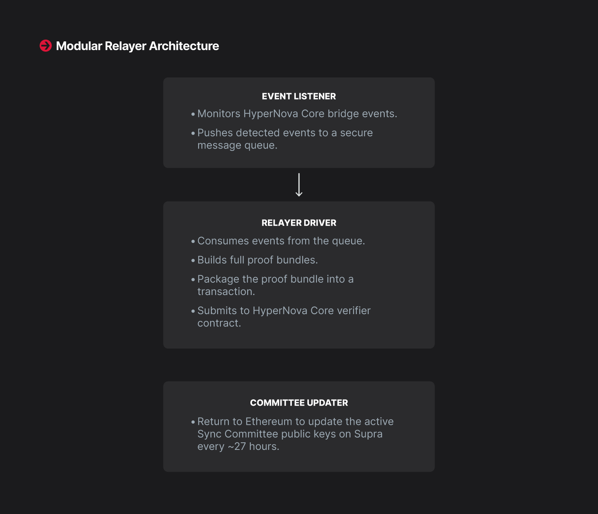

# Modular Relayer Architecture

SupraNova’s architecture relies on a relayer framework built using a modular design that separates concerns for better scalability and resilience.

<figure><figcaption></figcaption></figure>

1. **Event Listener:**

* Monitors Ethereum for HyperNovaCore bridge events.
* Pushes detected events into a secure message queue.\

2. **Relayer Driver:**

* Consumes events from the queue, builds full proof bundles, including receipt proofs, ancestry proofs and Sync Committee signatures.
* &#x20;Packages the proof bundle into a transaction and submits it to the Supra HyperNovaCore verifier contract.\

3. **Committee Updater:**

* Independently monitors Ethereum to update the active Sync Committee public keys on Supra every \~27 hours.

This Modular flow allows any actor to permissionlessly run relayers, increasing redundancy and system liveness.

***

### Relayer and Committee Updater in SupraNova

The SupraNova bridge architecture relies on off-chain actors to maintain a permissionless, decentralized, and verifiable flow of events and proofs.

There are two critical off-chain roles:

* Relayer:  Responsible for monitoring ethereum events, generating necessary proofs and submitting them to Supra service contracts  along with the event.
* Committee Updater:  Responsible for refreshing Ethereum’s Sync Committee public keys on Supra every \~27 hours.

Both are incentivized economically through SupraNova’s fee model to perform their tasks reliably.

***

### Relayer Architecture

The Relayer is a permissionless component made up of three modular subsystems:

| Component      | Responsibility                                                                                                                                                           |
| -------------- | ------------------------------------------------------------------------------------------------------------------------------------------------------------------------ |
| Event Listener | Listens to Ethereum for bridge events (LOGX) emitted by HyperNovaCore                                                                                                    |
| Relayer Driver | 
Picks up the event from a queue, generates proofs ( receipt, ancestry) using Prover module and submits them to Supra’s HyperNovaCore verifier contract

 
 |
| Prover Module  | Generates the Ancestry and Receipt proofs and returns to Relayer                                                                                                         |

#### Event Listener

* Connects to an Ethereum node.
* Subscribes to bridge-related event logs (filtered by contract address and event topics).
* On event detection, publish it to a message queue.

#### &#x20;Relayer Driver

* Consumes events from the message queue.
* Uses the Ethereum fullnode RPC APIs to:

1. Fetch block headers
2. Fetch full transaction and receipt data

**Then it constructs a proof bundle which includes:**

1. Sync Committee signature aggregate
2. Receipt inclusion proof
3. Ancestry Proof&#x20;

#### Transaction Sender

* Builds a bridge request transaction.
* Attaches the full proof bundle as calldata.
* Submits the transaction to Supra’s HyperNovaCore verifier smart contract.


**If verification succeeds, the corresponding service layer (e.g., Token Bridge) is triggered to mint assets.**


***

### Committee Updater Architecture

The Committee Updater makes sure that SupraNova can always validate Ethereum blocks based on the latest Sync Committee.

#### Every 27 hours (approximately 8192 slots):

* Ethereum’s Beacon Chain rotates its Sync Committee members.
* Their aggregate public key and 512 public keys set must be updated on Supra.

#### **Tasks of the Committee Updater:**

* Monitor Ethereum’s finalized epochs.
* When a new Sync Committee becomes active:

1. Fetch the new sync committee public keys.
2. Submit an on-chain transaction to update Supra’s trusted keys inside HyperNovaCore.


**Make sure that relayer proofs referencing new epochs can be validated correctly.**


***

### Rewards and Incentives

| Actor             | Incentive Source | Reward Type                                   |
| ----------------- | ---------------- | --------------------------------------------- |
| Relayer           | Service Fee      | Paid periodically from treasury               |
| Committee Updater | Verification Fee | Paid directly during user bridge transactions |

**Without these actors:**

* No proof would be submitted.
* No committee keys would update.
* Bridge verification would halt.

SupraNova keeps liveness and decentralization by rewarding these permissionless participants&#x20;

***

### Failure Handling

| Failure                                          | System Behavior                                                                       |
| ------------------------------------------------ | ------------------------------------------------------------------------------------- |
| 
Relayer fails to submit proofs

 
 | Another relayer can pick up the event and submit                                      |
| Committee Updater fails to update keys           | Bridge verification pauses for new blocks; liveness resumes once updater submits keys |

**Thus, the system is resilient and non-reliant on any single actor.**
