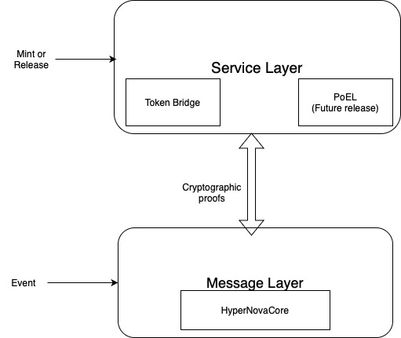

# Standard Two-Layer Approach in SupraNova

SupraNova organizes its bridging infrastructure into clearly separated functional layers, each responsible for a distinct part of the cross-chain communication process.

* The Message Passing Layer handles only the detection and verification of external blockchain events. It is operated by the HyperNovaCore protocol, which validates Ethereum events using cryptographic proofs like receipt proofs, and ancestry proofs. This layer remains lightweight and strictly focused on trustless message verification.&#x20;

&#x20;       a. In case of HyperNova protocol, the message passing layer validates source chain validator signatures and membership proofs.

&#x20;        b. In case of HyperLoop the message passing layer validates the bridge validator signatures.

* The Service Layer sits above the Message Layer and consumes validated messages to perform application-specific actions. The Token Bridge, responsible for minting wrapped ETH (wETH) on Supra, is an example of a Service Layer application. Future services could also be built independently at this layer without touching core validation logic.

**Future services such as PoEL may operate over the validated event flow but will be covered in their own documentation.**

This separation enables innovation at the Service Layer while maintaining strong cryptographic guarantees at the Message Layer. Below you can find the architecture of Two- Layer Approach:

<figure><figcaption></figcaption></figure>

\
\
