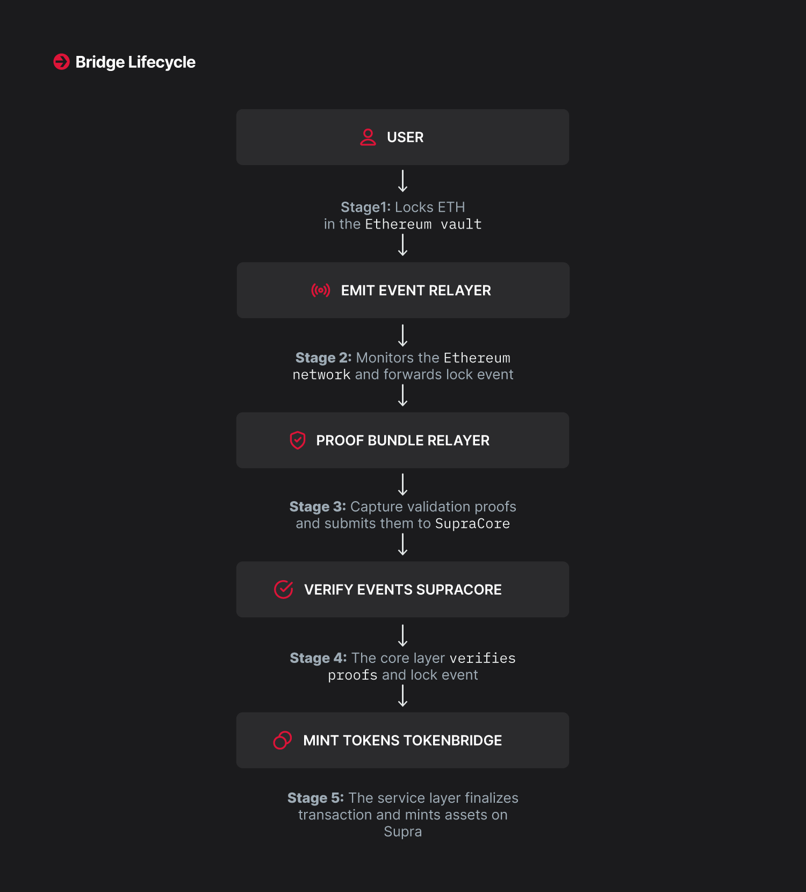

# Workflow of Hypernova Bridging within SupraNova

SupraNova uses the HyperNova trustless bridging protocol for bridging from Ethereum to Supra.&#x20;


At a high level, the bridging flow looks like this:

**Ethereum Wallet → Lock ETH → Emit Event → Relayer → Proof Bundle → Supra Verifier → Mint wETH**&#x20;


### The system consists of several coordinated components:

#### **Ethereum Source Chain**

* Bridge contracts in the Service layer like Token Bridging Component typically locks the asset, and the contracts in the message passing layer emits events containing the user bridge request details.
* The Ethereum-side bridge component resides in the message layer, it emits verifiable events that capture user intent, but it does not execute any asset-related logic on its own.

#### Off-Chain Relayer

* A permissionless relayer listens for bridge events.
* It constructs cryptographic proofs:

&#x20;   a. Receipt Proof (that the transaction succeeded)

&#x20;   b. Sync Committee Signature(that the block was finalized)

&#x20;   c. Ancestry Proof&#x20;

#### **Supra Destination Chain**

* The message is consumed by a service-layer smart contract (like the Token Bridge) that handles typically minting of wrapped tokens.\

* The relayer submits the proof bundle along with the bridge request event to the  Service Contract (Token Bridge contract) on Supra.\

* The Token Bridge contract does not perform validation itself. Instead, it submits the request event and the proof bundle  to the HyperNovaCore Verifier on Supra. If the proof is verified successfully, the control is returned to the service contract that  proceeds with minting of the wrapped token.

#### The HyperNovaCore checks:

* That the block is correctly signed (using Ethereum’s Sync Committee)
* That the event originates from the expected bridge contract
* That the transaction receipt is valid

Upon successful verification, wrapped ETH (wETH) is minted for the user.

#### Below you can see the bridge life cycle:

<figure><figcaption></figcaption></figure>

***

### Consensus Validation in Ethereum to Supra HyperNova&#x20;

SupraNova does not rely on validator attestations. Instead of using third-party validators, HyperNova validates Ethereum blocks using consensus-level cryptographic signatures.

This validation logic powers the message-passing core of SupraNova, handled by HyperNova Core.

&#x20;It uses Ethereum’s native finality mechanisms:

* Gasper Consensus: Combines Casper the Friendly Finality Gadget with LMD-GHOST fork choice rule.
* Sync Committee Attestations: A lightweight subset of validators (512 randomly selected nodes) sign block headers every \~27 hours (8192 slots).

The bridge process checks that:

* The block after the block containing the bridge event has sufficient Sync Committee signatures.
* It uses an Ancestry Proof to connect to a recent block that does.

This makes sure that SupraNova bridges only from valid Ethereum blocks.

***

### Summary of Components

| **Component**                    | **Role**                                                                                                  |
| -------------------------------- | --------------------------------------------------------------------------------------------------------- |
| HyperNovaCore (Ethereum)         | Emit event                                                                                                |
| Token Bridge Contract (Ethereum) | Lock ETH                                                                                                  |
| Relayer                          | Generate proofs, submit to Supra                                                                          |
| HyperNovaCore Verifier (Supra)   | Validate proofs on-chain                                                                                  |
| Token Bridge Contract            | Mint wETH to user                                                                                         |
| Committee Updater                | Publishes new Sync Committee public keys to HypernovaCore Verifier on Supra every \~27 hours (256 epoch). |
